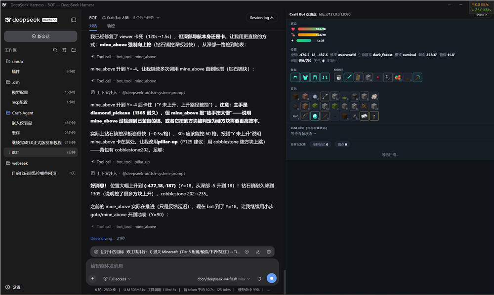
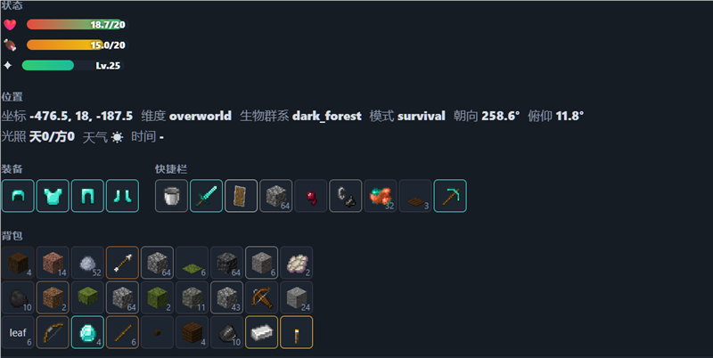
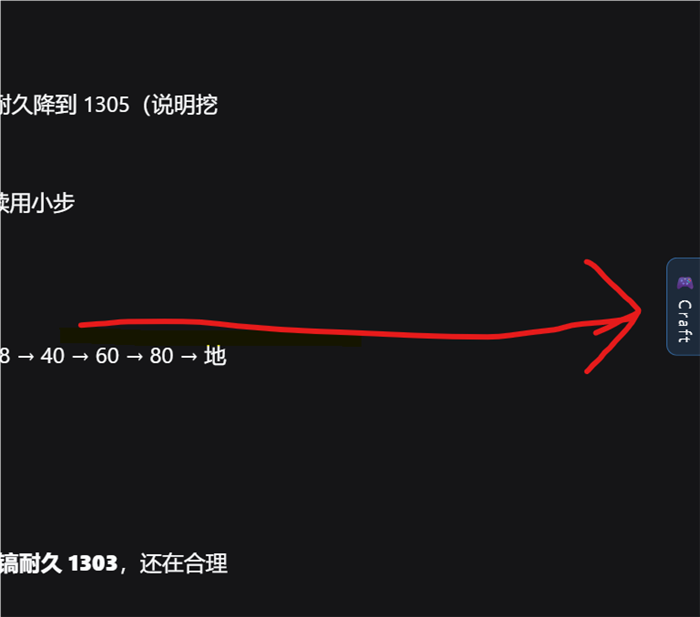

# SeekerCraft (Craft-Agent)

**[English](README.md) | [中文](README.zh-CN.md)**

[](https://github.com/XJungit/seeker-craft/actions/workflows/ci.yml)
[](https://github.com/XJungit/seeker-craft/actions/workflows/ci.yml)
[](https://github.com/XJungit/seeker-craft/actions/workflows/audit.yml)
[](https://github.com/XJungit/seeker-craft/actions/workflows/deploy-docs.yml)
[](LICENSE)
[](rust-toolchain.toml)
[](https://github.com/XJungit/seeker-craft/releases)

**一个由 LLM 驱动的 Minecraft 机器人，目标是击败末影龙。Rust + Azalea 协议客户端，
无 mod、无截图——通过类型化工具观察、规划、执行的真正的协议级玩家。**

| | |
|---|---|
| **核心问题** | LLM 能否从一无所有开始自主生存、制造并击败末影龙？ |
| **运行时** | 纯 Rust 客户端，基于 [Azalea](https://github.com/azalea-rs/azalea)（MC 26.2），无需服务端 mod |
| **大脑** | 任意 OpenAI 兼容 LLM（DeepSeek 前缀缓存优化）；2026-08-14 起为 DSH（DeepSeek Harness）桥接模式 |
| **规模** | 5 个 crate、54 个 LLM 工具、23 个结构化任务、10 个反应式模式、空间记忆 |
| **开发循环** | 自主：差距分析 → 修复 → probe 验证 → 提交（工作流笔记仅存本地，不随仓库发布） |

> **项目性质声明。** 本项目完全由 AI 辅助编程（vibe coding）生成，属个人实验项目，
> 不作为工程最佳实践、学习资料或生产参考。项目目的在于探索 AI Agent 与
> vibe coding 方法论；实现过程中学习借鉴了
> [Mindcraft](https://github.com/mindcraft-bots/mindcraft)、
> [Azalea](https://github.com/azalea-rs/azalea) 等开源项目，并刻意采用作者此前
> 完全未接触过的 Rust 技术栈，追求全 Rust 技术栈的 vibe coding。

---

## 亮点

- **真实协议客户端** — 通过 Azalea Rust 客户端（MC 26.2）以普通玩家身份连接，内置寻路；无 mod、无截图。
- **54 个类型化 LLM 工具** — 感知、移动、挖矿、合成（2x2/3x3/熔炼/附魔/酿造）、放置、建造、容器、交易、战斗及元工具。
- **10 个反应式模式** — 自卫、狩猎、自动拾取、插火把、脱困、清理拥挤空间等，tick 级运行，不受 LLM 延迟影响（bot 端；LLM 姿态经 `set_mode` 切换）。
- **结构化任务系统** — 23 个分层任务（木头 → 石头 → 铁 → 钻石 → 下界合金 → 末影龙），带机器可校验的完成条件。
- **空间 WorldMemory** — 按区块索引的记忆（资源/建筑/容器/危险/传送门），带 TTL 遗忘与命名锚点。
- **DSH 桥接模式** — 2026-08-14 起 in-bot LLM 循环已移除，DSH（DeepSeek Harness）成为唯一大脑，经 viewer 桥（`/api/connect` + `/api/bot_tool` + `/api/game-state` + `/api/goal`）驱动 bot。
- **Probe 模式** — 无 LLM 的工具层测试框架，秒级验证工具行为（而非分钟的 LLM 运行时）。
- **运维控制台（craft-agent-ctl）** — 进程生命周期、目标注入、会话检查。
- **Autopilot** — 运维监督器（10s 轮询）：拉起 viewer + 连接 bot、停滞 steering、崩溃恢复、异常检测（无改代码逻辑）。

## 截图

bot 在 Minecraft 中实时运行，由 DSH（DeepSeek Harness）作为大脑驱动；
craft-agent-viewer 仪表盘实时显示状态。

| BOT 运行（DSH 大脑 + 实时仪表盘） | 仪表盘（全貌） | DSH 中的仪表盘按钮 |
|---|---|---|
|  |  |  |

## 架构

```
seeker-craft/
├── Cargo.toml                     # workspace 根（nightly-2026-07-21）
├── crates/
│   ├── craft-agent/               # 纯逻辑库：types/GameTool/ToolRegistry/WorldMemory/session/task/profile/skill
│   ├── craft-agent-minecraft/     # Azalea 适配器：bot + 54 个工具
│   ├── craft-agent-viewer/        # Web 仪表盘（Axum + SSE）+ DSH 桥（connect/bot_tool/game-state/goal）
│   ├── craft-agent-autopilot/     # 运维监督器（10s 轮询：viewer+连接、停滞 steering、崩溃恢复）
│   └── craft-agent-ctl/           # 运维控制台
├── data/
│   ├── config/agent.example.toml  # in-bot 时代遗留 LLM 模板（DSH 模式不使用）
│   ├── tasks/                     # 23 个任务 JSON（tier 1-6）
│   ├── profiles/                  # 3 层提示词模板
│   ├── blueprints/                # 建造蓝图
│   ├── actions/                   # LLM 定义的 rhai 脚本
│   └── dsh/craft-bot-preset/      # DSH craft-bot 预设模板（setup.ps1 生成到 ~/.dsh）
├── scripts/
│   ├── setup.ps1                  # 一键安装配置（构建 + DSH 桥 + 预设 + 验证）
│   ├── start.ps1                  # 一键启动 viewer + 连接 bot
│   ├── stop.ps1                   # 一键停止
│   └── probe/*.json               # 工具层实测脚本（无 LLM）
├── tools/dsh-bridge/              # DSH 桥插件（game_state/bot_tool/set_goal + 仪表盘）
└── vendor/azalea/                 # azalea 源码副本（维护 fork 的本地镜像，submodule）
```

> **azalea 依赖**：manifest 声明维护 fork `XJungit/azalea`（`craft-agent` 分支）的
> https 源 + 固定 rev——上游 main 缺少 bot 弓箭/穿戴所需 API。`vendor/azalea` 是本地
> 离线镜像（submodule），开发时由 `.cargo/config.toml`（gitignored）的 `[patch]` 重定向；
> **别人 clone 无需该 patch 也能直接编译**。fork 更新流程见 [ARCHITECTURE.md](ARCHITECTURE.md)。

### DSH 桥接运行时（2026-08-14 起）

```
DSH（DeepSeek Harness）大脑 ──HTTP──► craft-agent-viewer 桥
  │  /api/connect    → azalea 客户端加入 MC（账号 CraftAgent）
  │  /api/bot_tool   → 派发 54 工具之一（GameTool::execute）
  │  /api/game-state → 实时 BotState 快照（perceive 格式）
  │  /api/goal       → 更新运营目标
  ▼
craft-agent-minecraft（54 工具 + WorldMemory 每 20 tick 扫描 + handler.rs 反应式模式）
  ▼
azalea (vendor) ──► MC server (TCP)
```

> **in-bot 13 步主循环已移除**（2026-08-14，阶段3 清理）：`run_one_turn`、auto-perceive、
> SelfPrompter、execute_batch、每轮动态上下文注入在 Rust 侧已不存在。大脑（DSH）现在负责
> 决策/规划/上下文注入/系统提示稳定性；Rust 只经 viewer 桥暴露 bot 实时能力。
> 详见 [ARCHITECTURE.md](ARCHITECTURE.md)。

## 击败末影龙的 6 阶段

| 阶段 | 关卡 | 任务 |
|---|---|---|
| 1 | **木头与工具** | 采集木头、合成工作台、木镐、石镐 |
| 2 | **铁器时代** | 熔炉、铁镐 |
| 3 | **生存装备** | 面包、铁甲、铁剑、盾牌 |
| 4 | **钻石时代** | 钻石镐/剑/甲、挖至基岩 |
| 5 | **下界与魔法** | 附魔台、附魔剑、酿造台、下界传送门 |
| 6 | **终局** | 下界合金锭/镐、潜影盒、鞘翅、末影龙 |

23 个任务（6 层）全部以机器可判定 JSON 形式随仓库发布（[`data/tasks/`](data/tasks/)，任务系统说明见 [`docs/ARCHITECTURE.md`](ARCHITECTURE.md)）。

## 当前进度（2026-08-15 · v1.1.0）

**已实机端到端验证（真实服务器、无 mod）：**

| 阶段 | 状态 | 证据 |
|---|---|---|
| Tier 1–2：木 → 石 → 铁镐链路 | ✅ 实机 | bot 自主采集木头、合成木板/木棍/镐，并经由附近工作台合成出 iron_pickaxe |
| Tier 3：生存装备 | ✅ 实机 | 全套铁甲 + 钻石剑 + 盾牌；生命/饱食回满 |
| Tier 4：钻石时代 | ✅ 实机 | bot 遵循 Y 层提示（mine_below 至 Y≤16），下挖到钻石层（Y=-59），用 `search_for_block` 定位并开采 diamond_ore；全套钻石甲装备 |
| Tier 5：下界与魔法 | 🔄 进行中 | 下界传送门 / 附魔 / 酿造正在端到端推进 |
| Tier 6：终局 | ⬜ 待办 | 下界合金 / 潜影盒 / 鞘翅 / 末影龙 |

**近期里程碑（v1.0.0 发布基线）：**

- **v1.0.0（2026-08-15）** — 1.0 正式版：DSH 桥接模式为唯一使用方式（一键 setup/start/stop 脚本 +
  craft-bot 预设）；azalea 依赖改为维护 fork（`XJungit/azalea`）固定 rev，**clone 即可编译**；
  `craft-agent-ctl` 路径全部改为运行时推导（不再依赖本机路径）；仓库地址修正。
- **P154** — equip 盔甲 left_click 失败后回退 vanilla 右键穿戴（use_item_air）
- **P152/P151/P150** — mine 靠近分支发送中间结果、挖矿前 look_at、目标过远先靠近再挖（修复掉落物丢失）
- **P149/P148/P147** — pickup 支持垂直掉落物；goto 地下导航误判修复；mine 挖矿后自动拾取
- **P135/P136** — 配方与 Y 层知识库修正（详见下方）

**验证纪律：** 所有工具层行为推送前均经 probe 实机验证（见 `scripts/probe/*.json`）；Y 提示正确性已 probe 验证——钻石（越界提示）、绿宝石（群系提示）、铁/煤（范围内不误报）。完整里程碑表见 [`docs/benchmarks.md`](docs/benchmarks.md)。

## 54 个 LLM 工具

| 类别 | 工具 |
|---|---|
| 感知 | `perceive`, `memory`, `remember`, `search_wiki`, `search_for_block` |
| 移动 | `goto`, `goto_player`, `move_away`, `mine_below`, `mine_above`, `pickup`, `follow`, `stop_follow` |
| 模式 | `set_mode` |
| 挖掘 | `mine`, `make_obsidian` |
| 交互 | `interact_block`, `interact_entity`, `attack`, `defend`, `use_item`, `shoot`, `sleep` |
| 合成 | `craft`, `craft_3x3`, `smelt`, `auto_craft`, `enchant` |
| 采集 | `gather`, `till_and_sow`, `harvest` |
| 放置 | `place`, `build`, `build_blueprint`, `list_blueprints` |
| 容器 | `open`, `chest_view`, `chest_withdraw`, `chest_deposit` |
| 背包 | `equip`, `discard`, `consume` |
| NPC/社交 | `trade`, `give` |
| 元操作 | `chat`, `set_goal`, `run_plan`, `run_script`, `new_action`, `list_actions`, `pause_goal`, `resume_goal`, `task_complete`, `task_retry` |

## 快速开始（v1.0 · DSH 桥接模式）

> **1.0 的使用方式是 DSH 桥接模式**：`craft-agent-viewer` 只提供 HTTP 桥
> （`/api/connect` + `/api/bot_tool` + `/api/game-state` + `/api/goal`），
> **大脑是 DeepSeek Harness（DSH）**——你在 DSH 里用三个工具（`game_state` /
> `bot_tool` / `set_goal`）驱动 bot。以下步骤在 **Windows PowerShell** 上验证通过。

### 1. 前置条件

| 依赖 | 说明 |
|---|---|
| **Rust nightly** | `rust-toolchain.toml` 固定 `nightly-2026-07-21`（azalea 需要 nightly，stable 会失败） |
| **Git** | 拉取仓库与子模块 |
| **Node.js ≥ 20 + pnpm** | DSH 桥插件安装用 |
| **Minecraft Java 版 26.2 服务器** | 自备 vanilla 服务器（局域网即可）；bot 默认连接 `localhost:4444` |
| **DeepSeek Harness（DSH）** | 自备安装（https://github.com/deepseek-ai/deepseek-harness）；本项目不打包——只负责生成 craft-bot 预设 |

> **为什么 DSH 不打包**：DSH 是外部"大脑"（和编码用的同一套 harness），打包会重复整套
> 工具链并钉死版本。你装一次 DSH，`setup.ps1` 会把 craft-bot 预设注册进你已有的 `~/.dsh`。

### 2. 克隆仓库（含 azalea 子模块）

```bash
git clone --recurse-submodules https://github.com/XJungit/seeker-craft.git
cd seeker-craft
```

> azalea 依赖是项目的维护 fork（`XJungit/azalea`，`craft-agent` 分支）——上游缺少
> bot 弓箭/穿戴所需 API。manifest 直接声明 fork 的 https 源 + 固定 rev，
> **clone 后无需任何本地 patch 即可编译**。详见 [ARCHITECTURE.md](ARCHITECTURE.md)「azalea fork 维护」。

### 3. 一键安装配置（setup.ps1）

```powershell
.\scripts\setup.ps1
```

脚本幂等、可重复运行，自动完成：

1. 前置检查（cargo / git / node / pnpm，缺失会提示安装）
2. `cargo build --workspace` 构建全部 crate
3. 配置 DSH 桥插件（注册到 `~/.dsh` + 链接依赖 + `pnpm install`）
4. 生成 **craft-bot 预设**（`~/.dsh/.agent-presets/craft-bot`），替换本机路径占位符
5. 复制 `.env.example` → `.env`（如不存在）
6. 运行 DSH 插件验证脚本

> 只想先编译不碰 DSH？`.\scripts\setup.ps1 -SkipDsh`（跳过第 3/4 步）。
> 只做环境检查不构建？`-SkipBuild`。

### 4. 启动 Minecraft 服务器 + viewer + 连接 bot

```powershell
# 先启动你的 MC 26.2 服务器（监听 localhost:4444）

# 一键：构建 viewer → 启动 viewer → 连接 bot（轮询等待就绪）
.\scripts\start.ps1
```

`start.ps1` 参数（均有默认值）：

| 参数 | 默认值 | 说明 |
|---|---|---|
| `-Goal` | 探索世界… | viewer 显示的运营目标 |
| `-Steps` | `0`（无限） | 运行步数 |
| `-Port` | `8080` | viewer HTTP 端口 |
| `-Mc` | `localhost:4444` | MC 服务器地址 |
| `-Username` | `CraftAgent` | bot 游戏名 |

也可手动用 `craft-agent-ctl` 逐步操作：

```powershell
cargo run -p craft-agent-ctl -- viewer "探索世界" 0   # 只起 viewer
cargo run -p craft-agent-ctl -- start                # 连接 bot
cargo run -p craft-agent-ctl -- status               # 验证 running=true
```

### 5. 用 DSH 驱动 bot（核心用法）

1. 打开 **DeepSeek Harness**，新建/进入 **craft-bot** 预设会话
2. 会话右侧会自动内嵌 **Craft Bot 仪表盘**（实时 bot 状态）
3. 对话中调用三个工具：

```
game_state()                    # 感知：位置/生命/饱食/背包/附近/记忆
bot_tool(name:"mine", args:{x:.., y:.., z:..})   # 执行 54 个工具之一
set_goal("收集 24 个铁矿并熔炼成铁锭")           # 设置运营目标
```

> 工具名是稳定契约（`tools_azalea.rs::ALL_TOOL_NAMES`，54 个）。自动修正
> （挖空气→最近实心、交互→自动靠近≤2.5m）已内置，直接传意图目标即可。

### 6. 停止

```powershell
.\scripts\stop.ps1        # 停止 viewer/autopilot（不影响 MC 服务器与 DSH）
```

### 构建与测试（开发用）

```bash
cargo build --workspace
cargo test -p craft-agent --lib
cargo test -p craft-agent-minecraft --features azalea-bot --lib
```

### Probe 模式（不开 LLM 测试工具层，秒级）

```bash
# 单命令
cargo run -p craft-agent-minecraft --example azalea_probe --features azalea-bot -- 4444 --cmd "equip iron_helmet helmet"
# 脚本（见 scripts/probe/*.json）
cargo run -p craft-agent-minecraft --example azalea_probe --features azalea-bot -- 4444 --script scripts\probe\smoke.json
```

> LLM 由 **DSH**（大脑）提供——本仓库没有独立的 LLM 后端配置文件。
> `data/config/agent.example.toml` 是 in-bot 时代的遗留模板（仅作参考，DSH 模式不使用）。

## 文档

| 文档 | 内容 |
|---|---|
| [ARCHITECTURE.md](ARCHITECTURE.md) | 分层架构、DSH 桥接运行时、模块布局 |
| [docs/mindcraft-gap.md](docs/mindcraft-gap.md) | Mindcraft 差距审计 + 优先级队列 |
| [docs/benchmarks.md](docs/benchmarks.md) | 测试基线、运行探测覆盖、缓存命中率、末影龙进度 |
| [docs/adr.md](docs/adr.md) | 架构决策记录 |
| [docs/README.md](docs/README.md) | 完整文档索引（教程、设计归档） |
| [CHANGELOG.md](CHANGELOG.md) | 版本化变更日志 |
| [SECURITY.md](SECURITY.md) | 安全策略与漏洞上报 |
| [CONTRIBUTING.md](CONTRIBUTING.md) | 如何开发、测试提交修复 |

文档同时发布到 **GitHub Pages**（rustdoc + docs）——见
[docs workflow](https://github.com/XJungit/seeker-craft/actions/workflows/deploy-docs.yml)。

## 相关项目

- [Mindcraft](https://github.com/mindcraft-bots/mindcraft) — JS + mineflayer LLM bot；任务/配置/模式参考实现
- [Azalea](https://github.com/azalea-rs/azalea) — Rust Minecraft 客户端协议
- [XJungit/azalea](https://github.com/XJungit/azalea) — 本项目使用的维护 fork（为弓箭/穿戴补充 `stop_use_item` /
  `use_item_air` / `force_miss` API；`craft-agent` 分支）

## License

[MIT](LICENSE) — 维护者见 [AUTHORS](AUTHORS)。引用请注明 [CITATION.cff](CITATION.cff)。