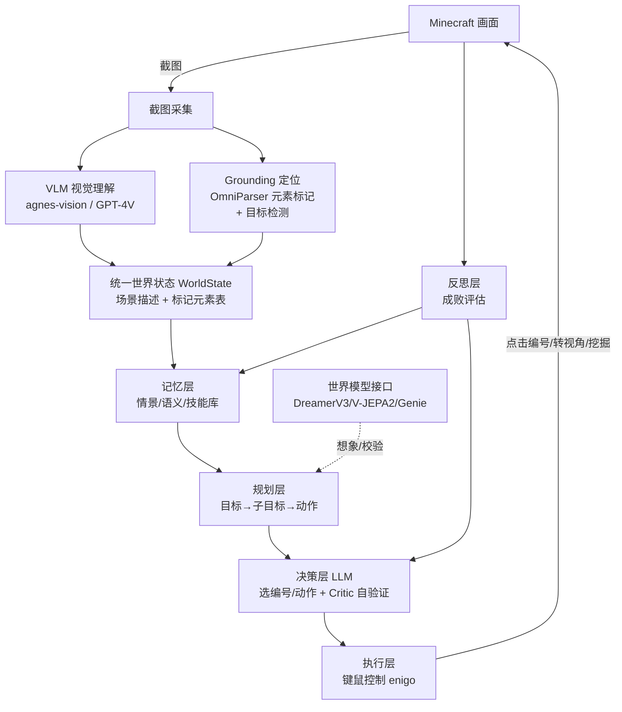
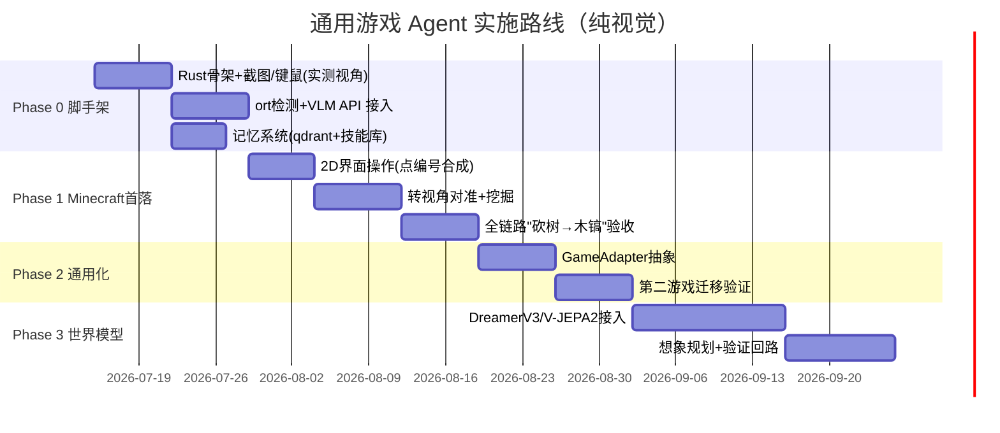

# 通用游戏 Agent 框架 — 方案设计（纯视觉路线）

> ⚠️ **本文档描述的是早期纯视觉路线设计（截图+VLM+键鼠）。**
> 项目当前路线已转向 **mod-bridge 优先**（Fabric mod TCP 桥接，结构化感知+精确执行），
> `real` 纯视觉路径保留作备用。具体实现请参考 [`ARCHITECTURE.md`](./ARCHITECTURE.md) 和 [`docs/tutorials/`](./docs/tutorials/)。
> 本文保留作为历史设计参考。

> 版本：v0.4 ｜ 日期：2026-07-16 ｜ 状态：⚠️ **部分过时，保留作历史参考**
> 首落场景：Minecraft ｜ 路线：**mod-bridge 结构化控制 + 可选 VLM 视觉补充**，同时保留 real 真机路径
> **主语言：Rust**（ML 推理走 ONNX Runtime；VLM/LLM 走 HTTP API）｜ 前瞻预留：世界模型 / 具身智能

---

## 0. 路线定位（v0.2 关键变更）

本版从 v0.1 的"API 直读优先"**改为纯视觉通用路线**——像人类一样，只靠**看屏幕 + 动键鼠**玩游戏，不读游戏内存、不调游戏 API。

- **本质**：Cradle 范式（截图 → VLM → LLM → 键鼠）。
- **好处**：真正通用，任何游戏/软件都能套，零游戏定制接口。
- **代价**：慢（每步双模型推理）、定位难（VLM 报坐标不准）、实时游戏吃力。
- **首落**：Minecraft（用户指定）。它是这条路里**最难**的场景（实时 3D + 转视角 + 准星对齐），本方案专门为此设计了 grounding 与视角控制方案。

---

## 0.5 技术栈与编程语言（一览）

**主语言：Rust（Edition 2024，1.85+）。** 深度学习模型走 ONNX Runtime 推理，VLM/LLM 走 HTTP API——纯视觉路线让"必须自己跑的深度模型"极少，Rust 完全能主导。

| 层 | 职责 | crate / 服务 | 类型 |
|---|---|---|---|
| 截图 | 抓游戏画面 | `xcap` / `screenshots` | crate |
| 图像处理 | 裁剪、画标记框、预处理 | `image` / `imageproc` | crate |
| 元素/目标检测 | 框出可交互元素、树、矿 | `ort`(ONNX Runtime v2) 跑 YOLO/GroundingDINO | crate + ONNX 模型 |
| 视觉理解 | 看懂场景 + 描述带框截图 | agnes-vision / GPT-4V | HTTP API (`reqwest`) |
| 决策 | 想下一步做什么 | LLM API | HTTP API (`reqwest`) |
| 记忆 | 存/检索经验与技能 | `qdrant`(Rust 原生) / `lancedb` | crate / 嵌入式 |
| 键鼠控制 | 点击/转视角/挖掘 | `enigo` (0.6.x，最新稳定) | crate |
| 数据结构 | 定义 WorldState/Action | `serde` + enum | crate |
| 异步编排 | 串起主循环 | `tokio` | crate |
| 错误处理 | 统一错误 | `anyhow` / `thiserror` | crate |

**三类依赖分清**：
1. **纯 Rust crate**（xcap / image / enigo / qdrant / tokio / serde）— `cargo add` 即可。
2. **ONNX 模型 + `ort`**（YOLO 元素检测 / GroundingDINO）— 模型导出为 ONNX，`ort` 加载推理；Windows 可用 DirectML/CUDA 后端加速。
3. **外部 API**（VLM + LLM）— `reqwest` HTTP 调用，不占本地算力。

**关键绕坑设计**：OmniParser 由"图标检测(YOLO) + 图像描述(caption)"两部分组成。caption 部分转 ONNX 较麻烦——**但我们本就要调 VLM**，故让 VLM 直接描述"带编号框的截图"来替代 caption。Rust 侧只用 `ort` 跑轻量**检测模型**，语义交给 VLM API。这样避开最难转换的模型，纯 Rust 即可跑通。

**Rust 选它的取舍（诚实说明）**：
- ✅ 性能：实时截图 / 图像处理 / 键鼠事件循环高频操作，Rust 快、低占用。
- ✅ 类型安全：`WorldState` / `Action` 用 enum + 模式匹配表达，编译期消除一类状态/分支 bug。
- ⚠️ 拦不住核心 bug：agent 最易错的是**决策逻辑**（点错、对错准星），这类逻辑 bug 换语言防不住，仍靠 Critic 自验证 + 测试。
- ⚠️ AI 编码摩擦：借用检查/生命周期会让 AI 生成代码更常编译不过，迭代变慢；但本项目性能敏感，值得。

## 0.6 本机验证进展（2026-07-12）

路线确定后先钉死工程不确定项（详见 `phase0_verify/`）：

- **Rust 工具链**：cargo 1.95.0 / rustc 1.95.0 已装。
- **ONNX 本地推理**：`ort` 走 **DirectML** 在 RTX 3050 上可用，**无需 CUDA 工具链/cuDNN**；合成小检测骨干（1×3×640×640）单帧 **DML 1.52ms / CPU 2.97ms**（DML 快 1.9×）。结论：检测推理不会成为瓶颈。
- **enigo 实际版本**：cargo 解析到的最新稳定版是 **0.6.1**（0.7 尚未发布）。实测 API（脚手架 `enigo_mc_test` 已编译通过）：构造 `Enigo::new(&Settings::default())`；鼠标 trait 改名 `MouseControllable`→**`Mouse`**；方法 `mouse_move_relative`→**`move_mouse(x,y,Coordinate::Rel)`**，`mouse_click(b)`→**`button(b, Direction::Click)`**；`Coordinate` 变体为 **`Rel`/`Abs`**（非 `Relative`）。
- **Phase 0 真机验证（2026-07-12，三项全绿）**：脚手架 `phase0_verify/enigo_mc_test/` 已实测通过，通过标准见 `MC_VERIFY_CHECKLIST.md`。
  - **① enigo 视角旋转** ✅：`move_mouse(dx,0,Coordinate::Rel)` 能驱动 MC 视角转动（前提是 MC 为前台窗口——已从终端 `cargo run` 时程序化 `focus_minecraft()` 抢回前台，见 §5.3.1）。
  - **② xcap 截图完整性** ✅：**方法 A（`w.capture_image()` 窗口直捕）为主力**——抓的是窗口自身帧缓冲，**即使被其他应用遮挡也能拿完整界面**（对 VLM 输入至关重要）。`set_dpi_awareness()` 后从 629×658（裁断）→ 1091×724（覆盖率 99%）。方法 C（Monitor 全屏+裁切）仅作兜底（窗口被挡则挡的部分去不掉）。
  - **③ 输入坐标一致性** ✅：`move_mouse(x,y,Coordinate::Abs)` 绝对定位，偏差人眼不可辨（< 几像素），够 VLM 点击用。
  - **两个硬结论（Phase 1 必用）**：
    1. `enigo::set_dpi_awareness()` 后，**xcap 窗口坐标 = 物理像素**，enigo `Abs` 绝对坐标也走物理像素 → 二者同源，**直接用、不乘 scale_factor**（曾误 ×1.5 导致裁切/定位整体偏移，已废弃）。
    2. **MC 窗口化下，OS 光标移出 MC 窗口 → MC 自动暂停弹菜单**。所有点击目标必须钳制在窗口内、留 ~20px 安全边距，绝不主动移出；MC 主动暂停用 ESC 键而非移出光标。

## 0.7 工程结构（Cargo workspace · 2026-07-16 结构复审）

单一 workspace，根 `Cargo.toml` 用 `[workspace]` + `[workspace.dependencies]` 统一管理：

```
Craft-Agent/
├── Cargo.toml                 # [workspace] 成员清单 + [workspace.dependencies] 版本单点声明
├── Cargo.lock                 # 唯一锁文件（成员共享，杜绝版本漂移）
├── target/                    # 唯一编译产物（重依赖 xcap/reqwest 只编一次，成员复用）
├── config/agent.toml          # 多后端配置（VLM/LLM，一键切 active）
├── crates/
│   ├── craft-agent/           # 核心：通用抽象（types / GameAdapter / Agent 主循环）
│   ├── craft-agent-model/     # 模型客户端层：vision(VLM) + decision(LLM)，OpenAI 兼容多后端
│   ├── craft-agent-minecraft/# MC 适配器：mod-bridge + real 双路径工具集
│   └── craft-agent-viewer/    # 运行可视化（session JSONL -> Web 仪表盘）
├── mods/
│   ├── craft-agent-bridge/           # MC Fabric mod（Java）
│   └── craft-agent-bridge-1.21/      # MC 1.21 兼容分支
└── references/                # 参考项目源码（不参与主工程构建）
```

- **命名**：`craft-agent-model` 原名 `craft-agent-vlm`，因 `decision.rs`(LLM) 加入后名不副实而改名；命名应涵盖当前全部职责，而非最初单一职责。
- **依赖**：公共依赖（anyhow/serde/reqwest/xcap/…）在 `[workspace.dependencies]` 单点声明，成员写 `dep.workspace = true`，禁止各 crate 重复钉版本。

> **结构复审纪律（每个 Phase 里程碑收尾必做，防"结构性 bug 细菌"）**：
> 1. **命名一致性**：crate/模块名是否仍涵盖其全部职责（新增文件后易错位）？
> 2. **单一 workspace**：新建 crate 是否已纳入成员？是否出现第二份 Cargo.lock / target？
> 3. **依赖收敛**：公共依赖是否都走 `workspace.dependencies`，无重复钉版本？
> 4. **注释/文档时效**：Cargo.toml 与设计文档里的版本/结构描述是否与实测一致？

---

## 1. 背景与目标

### 1.1 为什么做

游戏是检验通用智能的天然试验场：开放环境、长程目标、物理直觉、实时决策。纯视觉路线让 agent 的能力（看懂画面→理解→决策→动手→复盘）与人类玩家、乃至具身智能高度同构——它学到的是"看着屏幕操作"这一最通用的技能。

### 1.2 目标定义

| 维度 | 目标 |
|---|---|
| 首落场景 | Minecraft：纯视觉跑通"砍树 → 合成木板 → 工作台 → 木镐"闭环 |
| 感知 | 截图 → VLM 理解 + OmniParser 元素标记（Set-of-Mark） |
| 决策 | LLM 基于标记画面选"编号/动作"，而非报像素坐标 |
| 执行 | 键鼠控制（enigo）：点击编号、转视角对准、挖掘/合成 |
| 通用性 | 抽象 `GameAdapter`，换游戏只换适配器，内核零改动 |
| 可进化 | Voyager 式技能库，越玩越强 |
| 前瞻预留 | 世界模型接口（DreamerV3 / V-JEPA2 / Genie） |

### 1.3 设计原则

1. **分层可插拔**：感知 / 记忆 / 规划 / 决策 / 执行 / 反思 独立可换后端。
2. **抽象动作空间**：agent 输出 `点击(③)` / `对准并挖掘(树)`，而非"按住左键 1.5 秒"。
3. **grounding 优先**：把"VLM 报坐标"这个不可靠动作，转成"选编号 / 检测框对准"。
4. **评测先行**：每 Phase 有可量化里程碑，避免"越修越乱"。
5. **世界模型后置但不缺席**：接口现在就留，分阶段接入。

---

## 2. 现有方案调研与借鉴

| 项目 | 感知 | 决策 | 记忆/技能 | 开源 | 对本方案价值 |
|---|---|---|---|---|---|
| **Cradle** | 截图 + VLM | LLM/VLM → 键鼠 | 通用 UI 记忆 | 是 | **主范式**：纯视觉通用 agent |
| **OmniParser** | 屏幕解析 → 元素框+编号 | — | — | 是 | **grounding 核心**：Set-of-Mark 定位 |
| **Voyager** | 环境反馈 | 生成代码技能 | 技能库+课程+critic | 部分 | **借鉴**：技能库 + 自动课程 + 自验证 |
| **GITM** | 文本状态 | LLM 三级规划 | 文本记忆 | 部分 | **借鉴**：目标→子目标→动作 分解 |
| **STEVE / MineDojo** | 视频预训练 VLM | VLM 策略 | — | 是 | Minecraft 视觉感知参考 |
| **DreamerV3** | RSSM 潜空间 | model-based RL | 隐状态 | 是 | 世界模型后端候选 |
| **V-JEPA 2** | 潜空间预测 | 零样本规划 | — | 是 | 物理校验器候选 |
| **Genie 3** | 生成式世界 | — | — | 否 | 预留 API 位（最强未开放） |

**取舍**：以 Cradle 为主范式；用 OmniParser 解决 grounding；用 Voyager 技能库实现进化；世界模型留接口，Phase 3 接开源后端。

---

## 3. 整体架构（纯视觉闭环）



**闭环**：截图 → VLM 看懂场景 + OmniParser 把可交互元素标号 → 合成世界状态 → 记忆检索 → 规划拆子目标 → LLM 选"点几号/做什么动作"（Critic 先校验）→ 键鼠执行 → 反思复盘回写记忆。

---

## 4. 核心模块设计

### 4.1 感知层（纯视觉，本方案重点）

职责：把屏幕截图转成 LLM 可决策的**统一世界状态**。双支路并行：

- **支路 A — VLM 语义理解**
  截图 → `agnes-vision` / GPT-4V → 自然语言场景描述（"前方 3 格有橡木树，背包有 2 木头，饥饿值偏低"）。回答"现在什么情况"。
  - **输入优化（已实现，2026-07-13）**：发送前把截图**最长边等比缩到 `max_side`（默认 768px）**再 base64 内联。由配置 `[vlm.backends.*].max_side` 控制、代码侧 `vision::real::downscale_png()`（Lanczos3）实现，未配置则零成本跳过。实测 MC 窗口 `1091×724 → 768×510`，PNG `426KB → 265KB`（省 38%），识图质量不打折。多数 VLM 内部本就按 ~768/1024 分块，缩到单块尺寸还省一次切片、减少视觉 token。**注意**：对 TTFT 为瓶颈的远端点（如 Agnes ~20s）墙钟改善有限；对计算受限/国内快端点（MiniCPM ~0.7s）省的是视觉 token 与上传，收益更直接。
- **支路 B — Grounding 定位（命门）**
  解决"VLM 说得出有什么，说不准在哪个像素"。分两种场景：
  - **2D 界面**（背包 / 合成 / 菜单）：**OmniParser** 解析出所有可交互元素 → 画框 + 编号①②③（Set-of-Mark）叠加回截图 → LLM 只需说"点击③"，系统查表拿③精确坐标。
  - **3D 世界**（砍树 / 挖矿）：**目标检测**（GroundingDINO / YOLO 识别树、矿石）给出目标边界框 → 算目标中心相对屏幕准星的偏移 → 转成鼠标相对移动量对准。
  - **P1.2 落地（2026-07-13）— MC 固定 UI 无需检测模型**：MC 的快捷栏(9 槽)/HUD 位置在给定分辨率下是确定的，直接由屏幕几何算出元素框，省去 OmniParser 这类检测模型（也契合"Rust 只跑轻量检测"的取舍）。新增 `crates/craft-agent-model/src/som.rs`：
    ```rust
    pub fn parse_mark_id(resp: &str) -> Option<u32>        // 先解析带圈数字①②③，再回退阿拉伯数字
    pub fn select_mark_id(client: &dyn VisionClient, marked: &Screenshot, instr: &str) -> Result<u32>
    pub fn mc_hotbar_marks(w, h) -> Vec<Element>            // 9 槽，底部居中
    pub fn mc_hud_marks(w, h)    -> Vec<Element>            // 1 区，左下
    #[cfg(feature = "real")] mod render { render_marks(png, elems) -> Vec<u8> } // 青框+橙点+白编号
    ```
    渲染：`imageproc` 画半透明青框 + 橙点 + `ab_glyph` 白编号（带圈数字 ①..⑳）。
    闭环：`mc_hotbar_marks` 算布局 → `render_marks` 叠加编号 → VLM 看编号图说"选 ③" → `select_mark_id` 解析。
    **实测**：`som_demo --select` 真机跑通，MiniCPM-V 选中编号=3（期望 3）。3D 目标检测对准（支路 B 第二项）留待 P2。
- **输出契约（Rust）**：
  ```rust
  struct WorldState {
      scene_desc: String,              // VLM 场景描述
      marked_elements: Vec<Element>,   // 标记元素表（可点编号）
      detected_targets: Vec<Target>,   // 3D 目标检测结果
      self_hint: String,               // 血量/饥饿/背包（HUD 视觉读取）
      screenshot: DynamicImage,        // image crate
  }
  struct Element { id: u32, label: String, bbox: [i32; 4], center: (i32, i32) }
  struct Target { label: String, bbox: [i32; 4], offset_from_crosshair: (i32, i32) }
  ```

### 4.2 记忆层

| 类型 | 内容 | 实现 |
|---|---|---|
| 情景 Episodic | 轨迹、成功/失败片段、错误原因 | qdrant + 时序日志 |
| 语义 Semantic | Minecraft 合成表、机制知识 | 文档库 + LLM 摘要 |
| 程序性 Procedural | **可复用技能（动作序列）** | 文件技能库 + 向量检索 |

技能库是进化核心：每个技能 = 动作序列 + 触发条件 + 自然语言描述，按状态检索复用，减少重复探索与 VLM 调用。

### 4.3 规划层

- 层次分解（GITM 三级）：`高层目标 → 子目标链 → 具体动作`。
  例：`造木镐` → `[找到树, 砍树凑够木头, 打开合成界面, 合成木板, 合成木棍, 合成木镐]`。
- 自动课程（Voyager）：技能不足时自动生成学习性子目标。
- 世界模型前瞻（预留）：想象中 rollout，剔除不可行分支。

### 4.4 决策层（LLM）

- **输入**：WorldState（场景描述 + 标记元素表 + 检测目标）+ 子目标 + 检索技能。
- **输出**：一个**抽象动作**（Rust enum，形式受限于 grounding 结果）——
  ```rust
  enum Action {
      Click { element_id: u32 },              // 点标记编号
      AimAndMine { target: String },          // 对准并挖掘
      Move { dir: Direction, ticks: u32 },    // WASD 移动
      Look { dx: i32, dy: i32 },              // 转视角（相对移动）
  }
  ```
- **Critic 自验证**：执行前 LLM 判断"该动作在当前画面下是否合理"，执行后靠"下一帧画面变化"判断是否达成，失败触发反思。这是纯视觉路线防幻觉乱点的核心安全阀。

### 4.5 执行层（键鼠控制）

职责：把抽象动作翻译成真实键鼠操作。

- **抽象动作 → 键鼠映射**（`enigo` 0.6.1 实测 API）：
  - `Click{id}` → 查元素中心坐标 → 先 `move_mouse(cx, cy, Coordinate::Abs)` 定位（或相对对准）→ `button(Button::Left, Direction::Click)`
  - `AimAndMine{target}` → 按偏移量 `move_mouse(dx, dy, Coordinate::Rel)` 转视角对准 → `button(Button::Left, Direction::Press)` 长按左键挖掘
  - `Move/Look/Place` → 对应 WASD 按键 / `move_mouse(dx,dy,Coordinate::Rel)` / `button(Button::Right, Direction::Click)`
  - 注：`Enigo::new(&Settings::default())` 需传 `&Settings`；鼠标方法来自 `Mouse` trait（旧名 `MouseControllable` 在 0.6 已改名）。详见 `phase0_verify/enigo_mc_test/src/main.rs`（已编译通过）。
- **关键工程坑（Minecraft 专属，Phase 0 已实测钉死）**：
  1. **Raw input**：MC 视角用 raw mouse input，`enigo` 的相对移动 `move_mouse(dx,dy,Coordinate::Rel)` **可驱动，但前提是 MC 为前台窗口**（已从终端 `cargo run` 时程序化抢前台，见 §5.3.1；无需退回 SendInput）。
  2. **视角是相对移动**：MC 游戏内准星锁屏幕中心，靠"相对移动量"转视角，不是绝对坐标。对准 = 目标偏移量 → 相对移动。
  3. **坐标空间统一（高 DPI 必读）**：调用 `enigo::set_dpi_awareness()`（PROCESS_PER_MONITOR_DPI_AWARE）后——
     - xcap `Window` 坐标访问器（`x()`/`y()`/`width()`/`height()`）返回**物理像素**（与显示器物理分辨率 2560×1600 同空间，窗口 `pos=(1375,196)` 能完整落在屏内即证）；
     - enigo `move_mouse(x,y,Coordinate::Abs)` 绝对坐标也走**物理像素** → 二者同源，**直接用、不乘 scale_factor**。
     - ❌ 曾误乘 `scale_factor`（×1.5）→ 裁切/定位整体偏移（得到 498×1090 狭长条），已废弃。**此规则对点击坐标计算是硬约束。**
  4. **MC 移出即暂停（点击必须钳制）**：MC Java 版窗口化下，**OS 光标一旦移出 MC 窗口 → MC 自动暂停弹菜单**。故——
     - 所有 UI 点击目标坐标必须 `clamp` 在窗口内、留 **~20px 安全边距**（如 `x ∈ [wx+20, wx+ww-20]`），绝不主动移出窗口；
     - 需要暂停时主动发 **ESC 键**，不要靠移出光标触发；
     - 2D 界面（背包/合成/菜单）操作必须在窗口内进行，VLM 输出的元素坐标先过钳制再执行。
  5. **截图方法选型**：优先 `Window::capture_image()`（方法 A，抓窗口帧缓冲、**遮挡免疫**）；Monitor 全屏+裁切（方法 C）仅作兜底（窗口被挡时挡的部分去不掉）。两人眼不可辨的偏差对 VLM 点击足够。
- **GameAdapter 接口（通用性核心，Rust trait）**：
  ```rust
  trait GameAdapter {
      fn capture(&self) -> Result<DynamicImage>;      // 截图
      fn perceive(&self) -> Result<WorldState>;       // 截图→检测+VLM
      fn execute(&mut self, action: Action) -> Result<ExecResult>; // 键鼠执行
  }
  ```
  - **MinecraftAdapter**（`crates/craft-agent-minecraft`，P1.4 落地）：xcap 截图 + VLM/SoM + enigo；ort 3D 检测留 P2。
  - **BrowserAdapter**：headless 截图 + DOM（网页游戏，后续）。
  - **DesktopAdapter**：xcap + enigo（其他桌面游戏）。

### 4.6 反思层

- 每步/子目标后评估成败（对比前后帧 + LLM 归因）。
- 成功 → 固化为技能；失败 → 写入错误案例库，调整规划。

### 4.7 世界模型接口（预留）

```rust
trait WorldModel {
    fn encode(&self, state: &WorldState) -> Latent;
    fn predict(&self, latent: &Latent, action: &Action) -> Latent;
    fn rollout(&self, state: &WorldState, plan: &Plan) -> Trajectory;
}
```
（世界模型后端多为 Python/PyTorch：Phase 3 可用 ONNX 导出后 `ort` 推理，或起一个 Python 推理 sidecar 供 Rust 通过 HTTP/gRPC 调用。）

| 后端 | 角色 | 开源 | 接入 |
|---|---|---|---|
| DreamerV3 | 潜空间想象规划 | 是 | Phase 3 |
| V-JEPA 2 | 物理可行性校验 | 是 | Phase 3 |
| Oasis / GameGen | 轻量视频沙盒 | 是 | Phase 3（探索） |
| Genie 3 | 最强世界模拟器 | 否 | 预留 API 位 |

混合范式：`LLM 规划 → 世界模型 simulate → verify → execute`。

---

## 5. Minecraft 纯视觉打通方案

### 5.1 技术选型

| 模块 | 选型 | 说明 |
|---|---|---|
| 主语言 | **Rust**（Edition 2024, 1.85+, tokio 异步） | 性能 + 类型安全 |
| 截图 | `xcap` / `screenshots` | 锁定 MC 窗口区域 |
| 图像处理 | `image` / `imageproc` | 裁剪、画框、预处理 |
| 检测推理 | **`ort`**(ONNX Runtime v2) | 跑 YOLO 元素检测 / GroundingDINO |
| Set-of-Mark | `ort` 检测 + `imageproc` 画编号框 | 元素标号叠加 |
| VLM | `agnes-vision` / GPT-4V（`reqwest`） | 场景理解 + 描述带框图 |
| LLM | 现有 LLM API（`reqwest`） | 决策 |
| 键鼠 | **`enigo` (0.6.x)**（必要时 `windows` crate SendInput） | 视角控制需实测 |
| 记忆 | `qdrant` / `lancedb` + JSON 技能库 | 向量检索 |
| 运行环境 | Minecraft Java 版（窗口化固定分辨率） | 便于截图/坐标基准 |

> **模型来源**：YOLO/GroundingDINO 有现成 ONNX 导出；若某模型转 ONNX 受阻，仅将**那一个模型**退回 Python 推理 sidecar，Rust 主框架不变。

### 5.2 Phase 1 里程碑（验收标准）

```
找到树 → 对准并砍树凑够木头 → 打开合成界面 → 合成木板 → 合成木棍 → 合成木镐
```
验收：
- 端到端纯视觉自动完成，无人工干预、不读游戏内存/API；
- grounding 命中率：2D 界面点击准确率 > 90%，3D 对准挖掘成功率 > 70%；
- 技能库产出 ≥3 个可复用技能，二次同类任务复用率 > 50%。

### 5.3 由易到难的验证阶梯（降低 Minecraft 难度风险）

鉴于 MC 纯视觉难度高，Phase 1 内部再拆台阶，逐级验证：

1. **纯 2D 界面操作**（最易）：只在背包/合成界面里，用 `ort` 检测元素 + `imageproc` 画编号框（Set-of-Mark）完成合成——先证明"看懂 UI + 点得准"。
2. **静止转视角对准**（中）：站着不动，把准星对准眼前的树——证明"目标检测 + 视角相对移动"闭环。
3. **移动 + 对准 + 挖掘**（难）：走到树前、对准、挖满木头——证明完整 3D 交互。
4. **全链路长程任务**（最难）：串起来跑通"砍树→木镐"。

每级过了再上下一级，避免一上来就撞最难的全链路。

#### 5.3.1 P1.4 实施记录（2026-07-13）

- **落地 crate：`crates/craft-agent-minecraft`**（独立 crate，非塞进核心）。
  **架构修正**：最初设想把适配器放进核心 crate 并依赖 `craft-agent-model`，但模型层已反向依赖核心（共用 `WorldState`/`Screenshot` 类型）→ 会形成**循环依赖，Cargo 直接拒绝编译**。故改为独立 adapter crate，单向依赖 `craft-agent`（核心抽象）+ `craft-agent-model`（VLM/SoM），契合"换游戏 = 换 Adapter crate"的通用框架定位。真机依赖（xcap/enigo/image/model-real）全部 gated 在 `real` 特性，默认构建轻量、CI 无显示亦可编译。
- **`MinecraftAdapter` 三方法**：
  - `capture`：默认 xcap 直捕 MC 窗口（方法 A，遮挡免疫）→ 编码 PNG（供 VLM/SoM 消费）；**全屏模式改用方法 C**（`Monitor::capture_image()` 主显示器整屏，独占全屏 D3D 下方法 A 会截黑帧）。全屏时 rect=(0,0,mw,mh)，局部坐标即屏幕坐标。
  - `perceive`：hotbar(9)+hud(1) 规则布局 → `som::render_marks` 编号渲染 → `VisionClient::describe` 场景描述 → 产出 `WorldState{marked_elements, ...}`。
  - `execute`：`Click`(绝对定位+坐标钳制/WINDOW_MARGIN)、`Look`(相对移动转视角)、`Move`(按键保持)、`AimAndMine`(长按挖矿)。**明确不发送 ESC**（ESC 开暂停菜单，属保留约束）；坐标不乘 scale_factor（DPI aware 已对齐物理像素）。
- **真机验证（2026-07-13 下午）**：
  - 感知半环（capture→perceive）**双后端验证通过**：Agnes 与 MiniCPM 均成功截 MC 窗口 + VLM 出真实场景描述（10 个标记齐全）。其间 MiniCPM 的 `api.modelbest.co` 一度持续 502（服务端故障，已恢复），临时用 `--env`(Agnes) 兜底。
  - 执行半环发现关键拦路虎：**enigo 的 `SendInput` 只投【前台窗口】的消息队列**；从终端 `cargo run` 时终端是前台，MC（哪怕独占全屏）被系统挂起/收不到输入 → `Look(50,0)` 视角不转。用 `mouse_probe` 示例验证 **enigo 本身能移动光标（Δx=50）**，故问题在「MC 不是前台」而非代码/库。**单纯切全屏不够**——终端仍抢前台，MC 依旧后台挂起。
  - **真因修复**：新增 `focus_minecraft()`（windows-sys `EnumWindows` 找 MC + `AttachThreadInput` 挂前台线程 + `SetForegroundWindow`/`SetFocus` 绕过 Windows 前台锁；独占全屏被挂起时 `ShowWindow(SW_RESTORE)` 唤醒），在 `execute` 发输入前、及 `perceive` 全屏模式下各调用一次。修复后 `--fullscreen --act` 视角应可转动（待用户真机确认）。
  - **结论/方案**：端到端闭环（P1.5）走 **MC 全屏 + 程序化抢前台**；adapter 已加 `new_fullscreen` + 方法 C 捕获 + `focus_minecraft`，`mc_step --fullscreen [--act]` 可用。窗口化仅作临时验证，需 `F3+P` 关暂停且保持前台。
- **诚实边界**：P1.4 仅覆盖 2D 固定 UI + 视角/移动/挖矿原语；3D 目标检测对准（§5.3 第 2 级、ort 检测）仍留 P2；`detected_targets` 当前恒为空。

---

## 6. 通用化抽象

- **GameAdapter**（4.5）屏蔽"怎么截图、怎么理解、怎么操作"。
- 换游戏 = 换 Adapter + 可能微调 grounding 提示，内核（记忆/规划/决策/反思）零改动。
- 迁移验证（Phase 2）：接一个慢节奏 2D 桌面/网页游戏，若内核改动 < 20% 即证明抽象成功。

---

## 7. 实施路线图



---

## 8. 风险与应对

| 风险 | 影响 | 应对 |
|---|---|---|
| **VLM 定位不准** | 点/挖偏，闭环断 | OmniParser 标编号 + 目标检测框，不让 VLM 直接报坐标 |
| **延迟高、调用贵** | 实时性差、烧钱 | 抽象动作 + 技能缓存降调用；实时段用脚本兜底 |
| **enigo 控不了 MC 视角** | 视角操作失灵 | ~~退回 `windows` crate SendInput~~ **`move_mouse(Rel)` 可驱动，但需 MC 为前台窗口**——已加 `focus_minecraft()` 程序化抢前台（见 §5.3.1），风险解除 |
| **实时性跟不上（MC 3D）** | 怪物/掉落追不上 | 先做静态/慢节奏子任务（5.3 阶梯）；暂停/慢速验证 |
| **LLM 幻觉乱点** | 误操作 | Critic 执行前校验 + 前后帧对比兜底 + 错误案例库 |
| **跨游戏迁移失败** | 通用性证伪 | Phase 2 用简单游戏先验证抽象 |

---

## 9. 前沿展望

- 世界模型作"内部模拟器"：LLM 在想象中试错再执行（Code World Models 已证）。
- 具身智能 VLA：把游戏动作 token 化汇入 VLM 输出（RT-2 / OpenVLA），统一"视觉→语言→动作"——与纯视觉路线天然契合。
- Genie 3 开放后：作无限训练/评估场，生成世界里廉价试错。

---

## 10. 下一步（可立即启动）

确认后 Phase 0 最小可运行切片：

1. 定义 `WorldState` / `Action` / `GameAdapter` 接口。
2. 搭"截图（xcap）→ 键鼠（enigo）"管线，**先单测能否控制 MC 视角**（最大工程风险，优先验证）。
3. 接 VLM + OmniParser，实现"截图→标记→LLM 选编号→点击"单步闭环（先在 2D 合成界面验证）。
4. 接 qdrant 技能库。
5. 按 5.3 阶梯逐级推进到全链路验收。

---

*本方案基于 2024–2026 年 Cradle / OmniParser / Voyager / GITM / DreamerV3 / V-JEPA2 / Genie 等公开工作归纳。路线：纯视觉（VLM 识别 → LLM 决策 → 键鼠控制），架构预留世界模型接口。*
